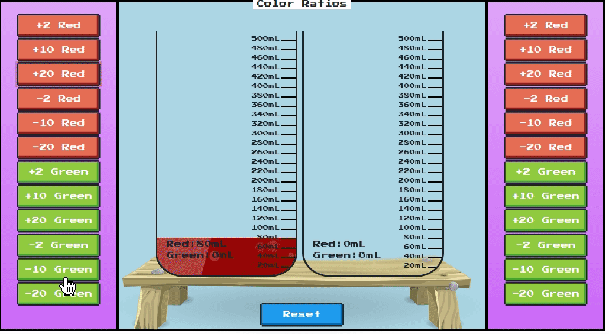

# Color Ratios

A visual demonstration showing how ratios work.



## Demo

View live deployment [here](https://www.math.uci.edu/~mathceo/games/color-ratios/)


## Project setup
```
npm install
```

### Compiles and hot-reloads for development
```
npm run serve
```

### Compiles and minifies for production
```
npm run build
```

### Lints and fixes files
```
npm run lint
```

### Customize configuration
See [Configuration Reference](https://cli.vuejs.org/config/).
